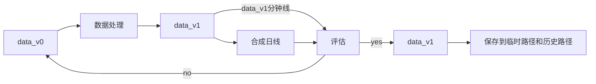

任务:港股数据处理

### 0.数据存储文件格式更改

xxxxxx为date，如20200101

- [x] 实现
- 把原始数据文件（以股票代码存储的csv文件）转换为待处理数据文件（以日期存储的pkl文件）

**python仓库代码位置：**   
> \trans_min_bar_format\trans_stk_csv_to_date_pkl.py   

**原始数据（dev_hist_v01）本地文件路径**
> D:\QUANT_GAME\python_game\pythonProject\DATA\local_develop_data\stock\HK_stock_data\jsy_develop_hist_data\v01_raw_data_stk_csv\

**修改结果（dev_hist_v02）本地文件夹路径**
> D:\QUANT_GAME\python_game\pythonProject\DATA\local_develop_data\stock\HK_stock_data\jsy_develop_hist_data\v02_raw_min_bar_date_pkl\

### 1.数据处理流程

#### 1.1 数据处理关注点

    1.检测可能有问题的数据
    2.出现问题的原因分析   
        - 局部错误还是整体错误
          - (某几天还是全部都有，例如：整体volume100,局部非交易时段的多余数据)   
        - 数据错误还是规则错误
          - (16:10前后的数据是数据本身错误 ，还是交易所规则变更导致的错误)
        - 原始数据录入错误还是行情数据错误
          - 出现负数成交额是录入错误还是行情软件也是错误（东方财富也有负数成交额）

    3.判断是否需要处理
        处理成本太大、没有其余数据参考、占比不高(没必要)、规则导致的错误
    4.处理后的数据如何进行评估？
        - 用分钟线评估还是合成日线评估
        - 评估方法
          - 在日线上，和akshare的东方财富和sina数据作比较（相对误差）
          - 抽几只绘制k线图直观评估
          - 用一些统计算法进行评估(可能会把正常数据也评估为错误数据)
          - ……  
    5.处理好的数据是否需要保存？
        - 处理后的数据，评估结果不一定是单向的，可能存在双向的；造成双向的原因是什么？(某些处理，减少了某些误差的同时，放大了某些误差)这次处理真的有效？是否需要考虑别的评估方法？ 

#### 1.2 数据处理的具体方向
- 缺失的数据
    - [x] 缺失某交易日数据
    - [x] 某交易日缺失大量数据
    - 某交易日的交易时段内缺失值
      - [x] 日内正常缺失,用前价格填充
      - [ ] 隔日正常缺失，用前交易日的价格填充
      - [ ] 日内异常缺失，筛选出非天气节日等因素造成的缺失，标注后并填充
- [x] 时间轴数据结构标准化
    - [ ] 缺失值按照缺失数据部分处理
    - [ ] 不在交易时段，多出来数据的检测及处理：剔除
- [ ] 负数数据
- [ ] 量价错误的数据
- [ ] 异常价格波动的数据
- [ ] volume100

#### 1.3 处理后数据的额外操作
  - 后复权因子的计算
    - 直接默认从2011-01-02开始计算
    - 对于重新上市的股票，也有函数，可以直接按照给定日期进行计算
  - 疑似千股的标注
    - 用量价数据和除权除息数据可以大致筛选出千股
  
---

### 2 数据处理

#### 2.1 时间轴数据格式标准化&日内用前价格进行填充（version v1.0）

**标准化数据格式**
| stk/date_time | open | high | low | close | volume | amount |pre_close | avg_price | hfq_factor |
| :----: | :----: | :----: | :----: | :----: | :----: | :----: |:----: |:----: |:----: |   
| hk00001/201603140930 | float | float | float | float | float | float | float | float | float |
|...|...|...|...|...|...|...|...|...|...|
| hk09999/201603141600 | float | float | float | float | float | float | float | float | float |

- [x] 实现 
- 把文件格式修改后的f'min{date}.pkl'的数据转换为标准化的数据格式，以供量化策略的学习和开发使用   
- 对日内的缺失值用前价格进行填充（量太多，暂时无法逐一核对缺失的原因）
- [ ] 性能提升
- [ ] 优化代码

**注意**
初步处理时，先将原数据字段标准化后的数据存入一个临时文件夹，把添加字段后的数据存入另一个临时文件夹，目的在于减小文件大小，提升处理文件时的读写速度。   
(*原始字段:open,high,low,close,volume,amountz*)   
(*添加字段：pre_close,avg_price,hfq_factor*)   
**处理完成后两个临时文件夹的更新必须同步！！！**

**python仓库代码位置：**   
> \trans_min_bar_format\standardize_data_format.py
 
**标准化结果（dev_hist_v10）本地文件存储路径**
> D:\QUANT_GAME\python_game\pythonProject\DATA\local_develop_data\stock\HK_stock_data\jsy_develop_hist_data\v10_raw_format_min_bar_date_pkl\

**标准化结果（dev_hist_v10）本地文件临时存储路径**
- 原始字段存储路径
> F:\local_tmp_data\stock\HK\v10_format_min_bar_raw_cols

- 添加字段存储路径
> F:\local_tmp_data\stock\HK\v10_format_min_bar_add_cols

---

### 3.数据处理结果汇总
#### 3.1 缺失值
缺失的数据用前交易日价格数据填充，volume和amount用0填充
##### 3.1.0 缺失的交易日
    20170407，20170410，20191129
##### 3.1.1 交易日缺失大量数据
    原始数据录入错误，大量数据缺失,
    20200515，20200518，20200519，20200520，20200521，20200715
##### 3.1.2 当日交易时段内缺失值
    - 异常缺失数据，数据做了其他聚合操作，筛出错误值
    - 正常数据，price用前一交易日的价格填充，volume和amount用0填充
### 
  