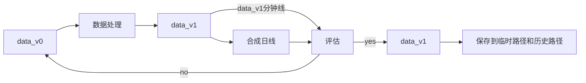
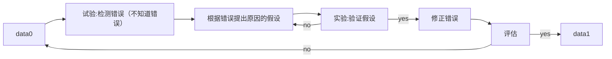

任务:港股数据处理

## 0.数据存储文件格式更改(v0.1,v0.2)

xxxxxx为date，如20200101

- [x] 实现
- 把原始数据文件（以股票代码存储的csv文件）转换为待处理数据文件（以日期存储的pkl文件）

**python仓库代码位置：**   
> \trans_min_bar_format\trans_stk_csv_to_date_pkl.py   

**原始数据（dev_hist_v01）本地文件路径**
> D:\QUANT_GAME\python_game\pythonProject\DATA\local_develop_data\stock\HK_stock_data\jsy_develop_hist_data\v01_raw_data_stk_csv\

**修改结果（dev_hist_v02）本地文件夹路径**
> D:\QUANT_GAME\python_game\pythonProject\DATA\local_develop_data\stock\HK_stock_data\jsy_develop_hist_data\v02_raw_min_bar_date_pkl\

## 1.数据处理流程

### 1.1 数据处理关注点

    1.检测可能有问题的数据
    2.出现问题的原因分析   
        - 局部错误还是整体错误
          - (某几天还是全部都有，例如：整体volume100,局部非交易时段的多余数据)   
        - 数据错误还是规则错误
          - (16:10前后的数据是数据本身错误 ，还是交易所规则变更导致的错误)
        - 原始数据录入错误还是行情数据错误
          - 出现负数成交额是录入错误还是行情软件也是错误（东方财富也有负数成交额）

    3.判断是否需要处理
        处理成本太大、没有其余数据参考、占比不高(没必要)、规则导致的错误
    4.处理后的数据如何进行评估？
        - 用分钟线评估还是合成日线评估
        - 评估方法
          - 在日线上，和akshare的东方财富和sina数据作比较（相对误差）
          - 抽几只绘制k线图直观评估
          - 用一些统计算法进行评估(可能会把正常数据也评估为错误数据)
          - ……  
    5.处理好的数据是否需要保存？
        - 处理后的数据，评估结果不一定是单向的，可能存在双向的；造成双向的原因是什么？(某些处理，减少了某些误差的同时，放大了某些误差)这次处理真的有效？是否需要考虑别的评估方法？ 

### 1.2 数据处理的具体方向
- 缺失的数据
    - [x] 缺失某交易日数据
    - [x] 某交易日缺失大量数据
    - 某交易日的交易时段内缺失值
      - [x] 日内正常缺失,用前价格填充
      - [ ] 隔日正常缺失，用前交易日的价格填充
      - [x] 日内异常缺失，筛选出非天气节日等因素造成的缺失，标注后不填充
- [x] 时间轴数据结构标准化
    - [x] 缺失值按照缺失数据部分处理
    - [x] 不在交易时段，多出来数据的检测及处理：剔除
- [ ] 负数数据
- [ ] 量价错误的数据
- [ ] 异常价格波动的数据
- [ ] volume100

### 1.3 处理后数据的额外操作
  - 后复权因子的计算
    - 直接默认从2011-01-02开始计算
    - 对于重新上市的股票，也有函数，可以直接按照给定日期进行计算
  - 疑似千股的标注
    - 用量价数据和除权除息数据可以大致筛选出千股
  
---

### 2 数据处理

#### 2.1.0 时间轴数据格式标准化&日内用前价格进行填充（version 1.0）

**标准化数据格式**
| stk/date_time | open | high | low | close | volume | amount |pre_close | avg_price | hfq_factor | is_liar|
| :----: | :----: | :----: | :----: | :----: | :----: | :----: |:----: |:----: |:----: | :----:|
| hk00001/201603140930 | float | float | float | float | float | float | float | float | float | int |
|...|...|...|...|...|...|...|...|...|...|
| hk09999/201603141600 | float | float | float | float | float | float | float | float | float | int |

- [x] 实现 
- 把文件格式修改后的f'min{date}.pkl'的数据转换为标准化的数据格式，以供量化策略的学习和开发使用   
- 对日内的缺失值用前价格进行填充（量太多，暂时无法逐一核对缺失的原因）
- [ ] 性能提升
- [ ] 优化代码

**注意**
初步处理时，先将原数据字段标准化后的数据存入一个临时文件夹，把添加字段后的数据存入另一个临时文件夹，目的在于减小文件大小，提升处理文件时的读写速度。   
(*原始字段:open,high,low,close,volume,amountz*)   
(*添加字段：pre_close,avg_price,hfq_factor*)   
**处理完成后两个临时文件夹的更新必须同步！！！**

**python仓库代码位置：**   
> \trans_min_bar_format\standardize_data_format.py
 
**标准化结果（dev_hist_v10）本地文件存储路径**（原始字段）
> D:\QUANT_GAME\python_game\pythonProject\DATA\local_develop_data\stock\HK_stock_data\jsy_develop_hist_data\v10_raw_format_min_bar_date_pkl\

**标准化结果（dev_hist_v10）本地文件临时存储路径**
- 原始字段存储路径
> F:\local_tmp_data\stock\HK\v10_format_min_bar_raw_cols

- 添加字段存储路径
> F:\local_tmp_data\stock\HK\v10_format_min_bar_add_cols

#### 2.1.1.0  v1.0合成日线评估结果
相对误差评估结果：(相对误差超过0.05)
|     |v10_vs_em|  v10_vs_sina|
|:---:|:---:|:---:|
|relative_err_open| 0.015319 | 0.014605 |
|relative_err_high| 0.014756 | 0.013290 |
|relative_err_low | 0.014267 | 0.012988 |
|relative_err_close| 0.016258 | 0.015938 |
|relative_err_volume| 0.550280 | 0.547957 |
|relative_err_amount | 0.126992| NaN |

#### 2.1.1.1 v1.0异常数据：不在交易时段内的数据（detect and fix outliers data）
合成日线的逻辑：   
>用当日向后填充价格后的数据合成日线，也就是说只要有交易的数据合成日线，那么日线数据中就不可能出现nan值。   

**错误**：合成的日线内有price全为nan值的数据104条，集中在**2011-10-12、2015-12-02**

**假设**：存在不在交易时段内的数据使得原始数据标准化后出现price.all()==np.nan值的数据
**验证假设**：
检查v0.2版本的数据中以下区间的数据（避开可能集合竞价的阶段）

    早市开盘一个小时以前
    早市收盘10分钟后到午市开盘前40分钟以前
    午市收盘10分钟后

**验证结果：**   

不在交易时段内的数据共有2817条（分钟线）
集中在以下26个交易日(26)
> 20111012, 20120323, 20121213, 20121219, 20130111, 20130117, 20130225, 20130318, 20130320, 20130402, 20130403, 20130425, 20130510, 20130603, 20130614, 20130617, 20130710, 20130815, 20130902, 20130916, 20131007, 20131021, 20131028, 20131204, 20140328, 20151202

除了合成日线的price中有全为nan值的数据104条(20111012、20151202)之外，还有其他2713条

**处理：** 
- 由于无法判断这些数据的异常原因（聚合、多余、填错位置等），且都在非交易时段和数量较小，对整体数据影响不大，剔除这些所有的数据
- 由于在标准化数据格式v1.0中，填充时间轴时，不在交易时段的数据是没有在标准化数据内的，因此只需要对合成日线后全为nan值的数据做剔除即可

#### 2.1.1.2 v1.0异常数据：不在交易时段内的数据（version 1.1）处理结果
剔除 20111012和20151202的数据即可
合成日线处理结果

#### 2.1.1.0  v1.0合成日线评估结果
**合成日线且评估  仓库代码位置**
> compose_and_evaluate_date_bar\v10
> 
**合成日线   本地存储位置**
>D:\QUANT_GAME\python_game\pythonProject\DATA\local_develop_data\stock\HK_stock_data\jsy_develop_hist_data\date_bar

相对误差评估结果：(相对误差超过0.05)
|     |v10_vs_em|  v10_vs_sina|
|:---:|:---:|:---:|
|relative_err_open| 0.015319 | 0.014605 |
|relative_err_high| 0.014756 | 0.013290 |
|relative_err_low | 0.014267 | 0.012988 |
|relative_err_close| 0.016258 | 0.015938 |
|relative_err_volume| 0.550280 | 0.547957 |
|relative_err_amount | 0.126992| NaN |

#### 2.1.1.1 v1.0异常数据：不在交易时段内的多余数据（detect and fix outliers data）
合成日线的逻辑：   
>用当日向后填充价格后的数据合成日线，也就是说只要当天有交易数据存在，那么日线数据中就不可能出现nan值。   

**错误**：合成的日线内有price全为nan值的数据104条，集中在**2011-10-12、2015-12-02**

**假设**：存在不在交易时段内的数据使得原始数据标准化后出现price.all()==np.nan值的数据
**验证假设**：
检查v0.2版本的数据中以下区间的数据（避开可能集合竞价的阶段）

    早市开盘一个小时以前
    早市收盘10分钟后到午市开盘前40分钟以前
    午市收盘10分钟后

**验证结果：**   

不在交易时段内的数据共有2817条（分钟线）
集中在以下26个交易日(26)
> 20111012, 20120323, 20121213, 20121219, 20130111, 20130117, 20130225, 20130318, 20130320, 20130402, 20130403, 20130425, 20130510, 20130603, 20130614, 20130617, 20130710, 20130815, 20130902, 20130916, 20131007, 20131021, 20131028, 20131204, 20140328, 20151202

除了合成日线的price中有全为nan值的数据104条(20111012、20151202)之外，还有其他2713条

**处理：** 
- 由于无法判断这些数据的异常原因（聚合、多余、填错位置等），且都在非交易时段和数量较小，对整体数据影响不大，剔除这些所有的数据
- 按照异常数据剔除即可，某些日期内有数据可用
- 由于在标准化数据格式v1.0中，填充时间轴时，不在交易时段的数据是没有在标准化数据内的，因此只需要对合成日线后全为nan值的数据做剔除即可

**不在交易时段内的多余数据处理的 仓库代码位置**
> detect_and_fix_outliers_data\not_in_trade_time\

**本地处理结果存储位置**
> D:\QUANT_GAME\python_game\pythonProject\DATA\local_develop_data\stock\HK_stock_data\jsy_develop_hist_data\min_bar\v11_fix_v10_not_in_trade_time_data

#### 2.1.1.2 v1.0异常数据：不在交易时段内的多余数据（version 1.1）处理结果
剔除 20111012和20151202的数据即可

**v1.0修正结果v1.1 合成日线 仓库代码位置**
>compose_and_evaluate_date_bar\v11

**v1.0修正结果v1.1 合成日线 本地存储位置**
> D:\QUANT_GAME\python_game\pythonProject\DATA\local_develop_data\stock\HK_stock_data\jsy_develop_hist_data\date_bar\v11_date_bar.pkl

合成日线后相对误差评估结果
**相对误差评估结果：(相对误差超过0.05)**
|     |v10_vs_em|  v10_vs_sina|
|:---:|:---:|:---:|
|relative_err_open| 0.015319 | 0.014605 |
|relative_err_high| 0.014756 | 0.013290 |
|relative_err_low | 0.014267 | 0.012988 |
|relative_err_close| 0.016258 | 0.015938 |
|relative_err_volume| 0.550280 | 0.547956 |
|relative_err_amount | 0.126990| NaN |

**v11vsv10**
|     |vs_em|vs_sina|
|:---:|:---:|:---:|
|relative_err_open| -0.0000002 | -0.0000002 |
|relative_err_high| -0.0000000 | -0.0000000 |
|relative_err_low | -0.0000002 | -0.0000002 |
|relative_err_close| -0.0000000 | -0.0000000 |
|relative_err_volume| -0.0000818 | -0.0000873 |
|relative_err_amount | -0.0000741| NaN |

v10到v11，结果有轻微改善
！（因为是剔除了不在交易时段的错误数据，其实也不算改善，只是在比对的时候，没有比对那些剔除的数据而已）！

---
### 2.2 缺失值处理   

由于港股存在天气节日等原因，可能在有交易的天数里，会有大批的某时间段内缺失值存在。先找出这些特殊的缺失值，会和别的缺失值情况混淆

#### 2.2.1 找出因节日或放假造成的“异常”缺失值
- 标准化一版不填充nan值的分钟线数据并合成日线
- 为了检测成批节日放假造成的开盘和收盘数据的缺失，从合成日线中找出open和close为nan值得数据
- 从这些open和close里为nan值得日线中，在某一天，所有股票数据都为nan的日期

因节日和天气造成的缺失结果
> - open isna:
> [20120522, 20120724, 20130522, 20130923, 20140916, 20150619, 20151202, 20170411, 20170419, 20200819, 20210628]
> - close isna:
> [20110202, 20121224, 20121231, 20130927, 20131224, 20131231, 20140130, 20141224, 20141231, 20150218, 20151224, 20151231, 20170127, 20180215, 20181224, 20181231, 20190204, 20191224, 20191231, 20200124]

检查出**错误**，以下一天内开盘收盘一段时间内的集中缺失，并不是因为节日天气等因素造成的：
> - open isna:
> [20120522, 20150619, 20151202, 20170411, 20170419]
> - close isna:
> [ 20130927]

错误原因：不明，无法直接对其进行处理，可暂时做标记表明这几日的数据有时间轴对不齐的错误。

#### 2.2.2 “非异常”缺失值填充

非异常缺失的数据，当日按照前一根k线的填充，隔日的用日线上一根k线的值填充。
日内填充的结果已在version1.1中，而隔日填充在处理时可以先不填充，避免对之后的处理产生影响。

---
### 2.3 负数值处理
| stk/date_time | open | high | low | close | volume | amount |   
| :----: | :----: | :----: | :----: | :----: | :----: | :----: |  
| hk00001/20190921 | <0 | <0 | <0 | <0 | <0 | <0 |  
---

##### 3.2.2 量价错误值
- 3.2.2.1 volume=0,amount!=0

    |stk/date_time|open|high|low|close|volume|amount|
    |:---:|:---:|:---:|:---:|:---:|:---:|:---:|
    |hk00001/20190921|np.float64|np.float64|np.float64|np.float64|**np.float64=0**|**np.float64!=0**|

- 3.2.2.2 volume!=0,amount=0
    |stk/date_time|open|high|low|close|volume|amount|
    |:---:|:---:|:---:|:---:|:---:|:---:|:---:|
    |hk00001/20190921|np.float64|np.float64|np.float64|np.float64|**np.float64!=0**|**np.float64=0**|

- 3.2.2.3 volume=0,amount=0, not_equal(open,high,low,close) 
    |stk/date_time|open|high|low|close|volume|amount|
    |:---:|:---:|:---:|:---:|:---:|:---:|:---:|
    |hk00001/20210104|err|err|err|err|**np.float64=0**|**np.float64=0**|

