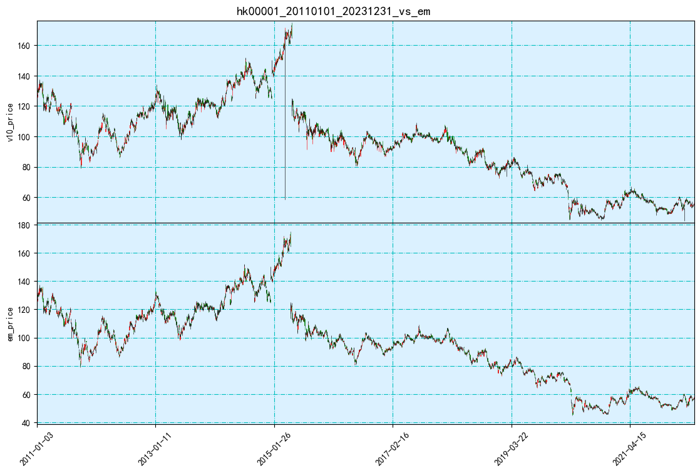
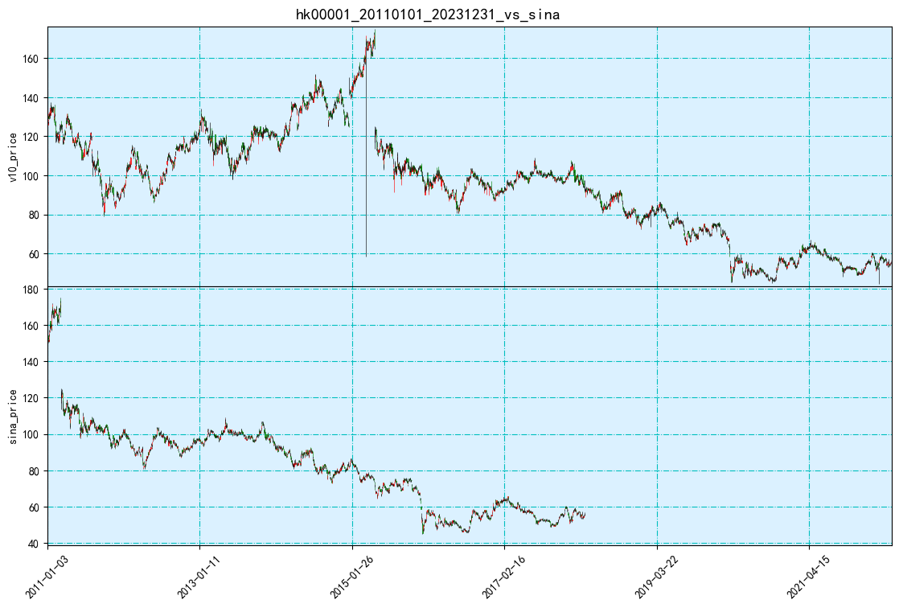
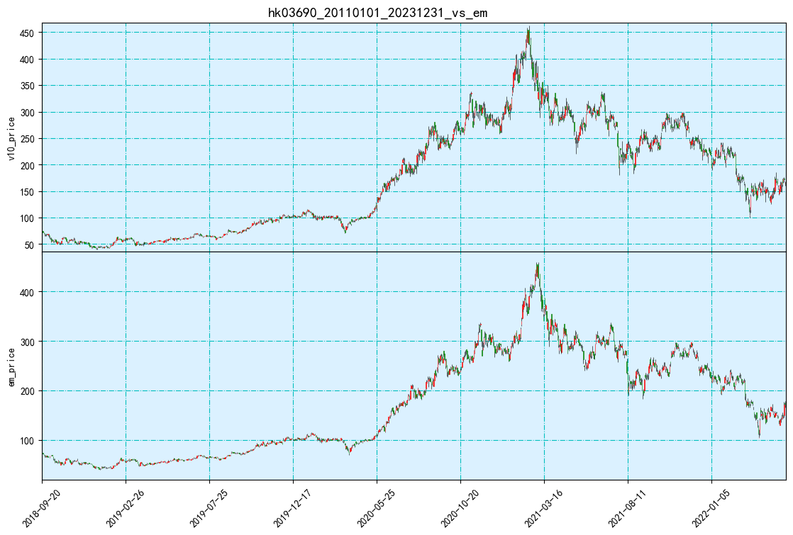
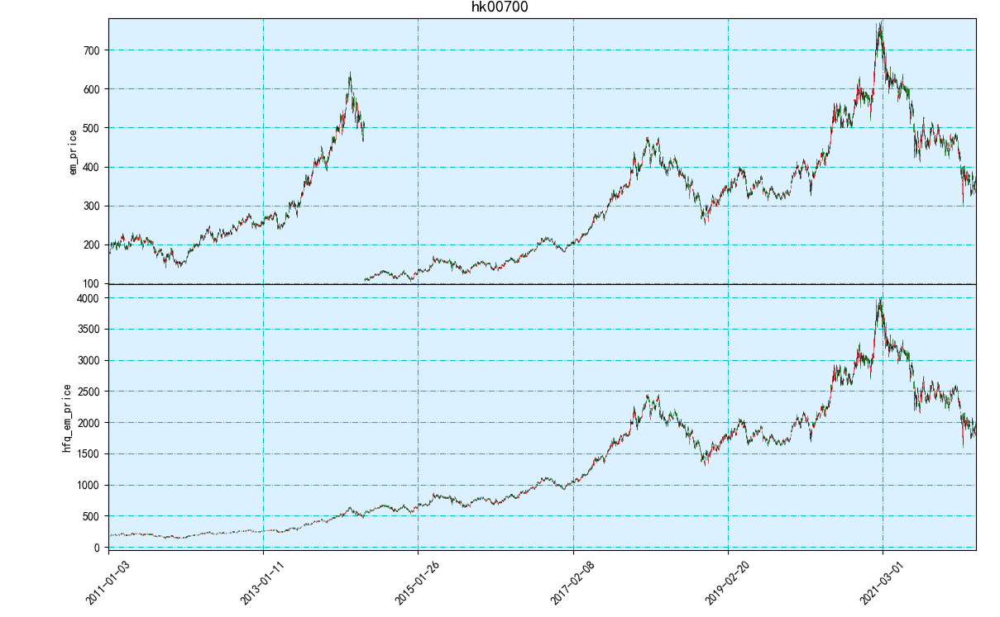
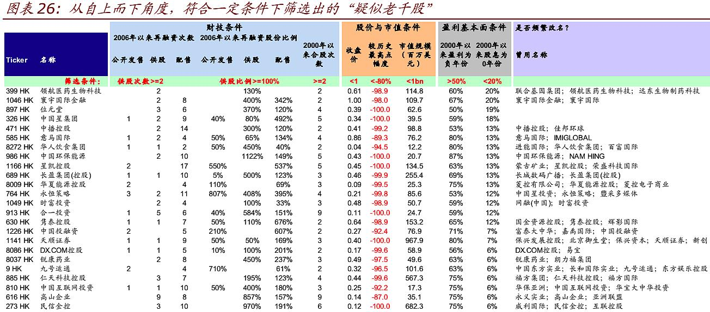

# hk_market_stk_data_processing_by_jsy  
---
## 0.港股交易规则
### 0.1 股票代码
hk00001 ~ hk99999   
*累计股票数: 3449*
- 创业板: hk08xxx 
  - *累计创业板：507*
- 暂时退市: hk4xxxx 
  - *累计退市: 0*
- 人民币交易: hk8xxxx 
  - *累计: 80*

牛熊证类似期权，以英文命名，金数源原始数据没有提供完整的牛熊证数据

***！！！存在退市后重新以同一代码或者其他代码上市的股票，或者股票代码不变，上市公司变更的股票！！！，因此无法长期不交易的股票是千股、退市、停牌***

### 0.2.1 目前交易时段
总交易日 2011-01-02 ~ 2022-05-21 (2798/2801)

### 0.2.2 过去交易时段变更
- 20110102 ~ 20110306
    - k_bars: 240
    - am: 10:00 ~ 12:30
    - pm: 14:30 ~ 16:00 
- 20110307 ~ 20120304
    - k_bars: 300
    - am: 9:30 ~ 12:00
    - pm: 13:30 ~ 16:00
- 20120305 ~ 20220521
    - k_bars: 330
    - am: 9:30 ~ 12:00
    - pm: 13:00 ~ 16:00
### 0.2.3 交易时段不变，规则部分微调 
- 20160725 ~ 20220521 交易时段不变，引入收盘竞价:
    - am: 12:00 ~ 12:10
    - pm: 16:00 ~ 16:10
    - 收盘竞价规则：
         
- 20160822 ~ 20220521 实行港股冷静期(市场波动调节机制)
    
    
    - -[市场波动调节机制(VCM) (hkex.com.hk)](https://sc.hkex.com.hk/TuniS/www.hkex.com.hk/Global/Exchange/FAQ/Securities-Market/Trading/VCM?sc_lang=zh-CN#collapse-13)

### 0.2.4 气候或者节日，出现只交易半天或突然截止的情况
- 气候
    - 盘中突然停止交易
    - 只有早市或者午市，或者一整天都没有
- 节日
    - 特殊节日前一天只有早市
**！虽然气候和节日都有只有早市交易的情况，
！但是节日早市有收盘集合竞价在早市最后一根k线，
！而气候可能没有集合竞价(只从k线上无法准确分辨)**

---

## 1.数据处理
### 1.0 数据处理方向
- 缺失的数据
    - [x] 缺失某交易日数据
    - [x] 某交易日缺失大量数据
    - 某交易日的交易时段内缺失值
      - [x] 日内正常缺失,用前价格填充
      - [ ] 隔日正常缺失，用前交易日的价格填充
      - [ ] 日内异常缺失，筛选出非天气节日等因素造成的缺失，标注后并填充
- [x] 数据时间轴标准化
    - [ ] 缺失值按照缺失数据部分处理
    - [ ] 不在交易时段，多出来数据的检测及处理：剔除2817根k线
- [ ] 负数数据
- [ ] 量价错误的数据
- [ ] 异常价格波动的数据
- [ ] volume100

### 1.1 缺失的数据
##### 1.1.1 缺失的交易日
    20170407，20170410，20191129
##### 1.1.2 交易日缺失大量数据
    原始数据录入错误，大量数据缺失,
    20200515，20200518，20200519，20200520，20200521，20200715
##### 1.1.3 当日交易时段内缺失值
    - 异常缺失数据，数据做了其他聚合操作，筛出错误值
    - 正常数据，price用前一交易日的价格填充，volume和amount用0填充

### 1.2 数据时间轴标准化(v1.0)
**标准化数据格式**
(*原始字段:open,high,low,close,volume,amountz*) 约80G
(*添加字段：pre_close,avg_price,hfq_factor*)   
| stk/date_time | open | high | low | close | volume | amount |pre_close | avg_price | hfq_factor |
| :----: | :----: | :----: | :----: | :----: | :----: | :----: |:----: |:----: |:----: |   
| hk00001/201603140930 | float | float | float | float | float | float | float | float | float |
|...|...|...|...|...|...|...|...|...|...|
| hk09999/201603141600 | float | float | float | float | float | float | float | float | float |
#### 1.2.1 日内缺失值填充
##### 1.2.1.1 合成日线相对误差评估结果
|     |v10_vs_em|  v10_vs_sina|
|:---:|:---:|:---:|
relative_err_open| 0.015319 | 0.014605 |
relative_err_high| 0.014756 | 0.013290 |
relative_err_low | 0.014267 | 0.012988 |
relative_err_close| 0.016258 | 0.015938 |
relative_err_volume| 0.550280 | 0.547957 |
relative_err_amount | 0.126992| NaN |
##### 1.2.1.2 合成日线k线图评估结果

**hk00001**

**hk03690**

### 1.n处理结果
|     |vn_vs_em|  vn_vs_sina|
|:---:|:---:|:---:|
relative_err_open| 0.014624 | 0.014627 |
relative_err_high| 0.014603 | 0.013910 |
relative_err_low | 0.014112 | 0.013640 |
relative_err_close| 0.016231 | 0.016686 |
relative_err_volume| 0.026133 | 0.019075 |
relative_err_amount | 0.129414 | NaN |

- em和sina相对误差的比例   

|     |em_vs_sina|
|:---:|:---:|
relative_err_open| 0.001798 |
relative_err_high| 0.002629 |
relative_err_low | 0.002045 |
relative_err_close| 0.001148 |
relative_err_volume| 0.005545 |

---

## 2.后复权处理
### 2.1 后复权处理算法
### 2.2 后复权处理函数
### 2.3 后复权处理结果
#### 2.3.1 hk00001
- 富途复权前

- 富途复权后

- 涨跌幅复权法复权结果
 
#### 2.3.2 hk00700
- 富途复权前

- 富途复权后

- 涨跌幅复权法复权结果

---

## 3.疑似千股标注
千股潜在特征：

多次合股
长期不分红
低股价（长期<1元）
跌幅深
成交量波动，隔日成交量大幅波动次数较大

中金研报千股结果参考

