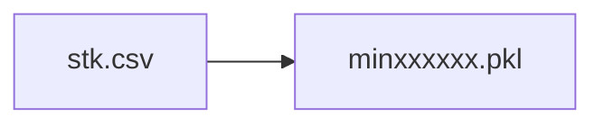

# hk_market_stk_data_processing_by_jsy  
***任务：港股数据处理***
## 主要流程  

### 1.数据存储文件格式修改

xxxxxx为date，如20200101

- [x] 实现
- 把原始数据文件（以股票代码存储的csv文件）转换为待处理数据文件（以日期存储的pkl文件）

**python仓库代码位置：**   
> \trans_min_bar_format\trans_stk_csv_to_date_pkl.py   

**原始数据（dev_hist_v01）本地文件路径**
> D:\QUANT_GAME\python_game\pythonProject\DATA\local_develop_data\stock\HK_stock_data\jsy_develop_hist_data\v01_raw_data_stk_csv\

**修改结果（dev_hist_v02）本地文件夹路径**
> D:\QUANT_GAME\python_game\pythonProject\DATA\local_develop_data\stock\HK_stock_data\jsy_develop_hist_data\v02_raw_min_bar_date_pkl\

### 2.数据格式标准化
- [x] 实现 
- 把文件格式修改后的f'min{date}.pkl'的数据转换为标准化的数据格式，以供量化策略的学习和开发使用   
- [ ] 性能提升
- [ ] 优化代码

初步处理时，先将原数据字段标准化后的数据存入一个临时文件夹，把添加字段后的数据存入另一个临时文件夹，目的在于减小文件大小，提升处理文件时的读写速度。   
(*原始字段:open,high,low,close,volume,amountz*)   
(*添加字段：pre_close,avg_price,hfq_factor*)   
**处理完成后两个临时文件夹的更新必须同步！！！**

**python仓库代码位置：**   
> \trans_min_bar_format\standardize_data_format.py
 
**标准化结果（dev_hist_v10）本地文件存储路径**
> D:\QUANT_GAME\python_game\pythonProject\DATA\local_develop_data\stock\HK_stock_data\jsy_develop_hist_data\v10_raw_format_min_bar_date_pkl\

**标准化结果（dev_hist_v10）本地文件临时存储路径**
- 原始字段存储路径
> F:\local_tmp_data\stock\HK\v10_format_min_bar_raw_cols

- 添加字段存储路径
> F:\local_tmp_data\stock\HK\v10_format_min_bar_add_cols

**标准化数据格式**
| stk/date_time | open | high | low | close | volume | amount |pre_close | avg_price | hfq_factor |
| :----: | :----: | :----: | :----: | :----: | :----: | :----: |:----: |:----: |:----: |   
|hk00001/201603140930 | float | float | float | float | float | float | float | float | float |
|...|...|...|...|...|...|...|...|...|...|
| hk09999/201603141600 | float | float | float | float | float | float | float | float | float |

### 3.数据结果评估 AND 异常数据检测及修正

- 每个数据的相对误差超过0.05的数据，认为是异常数据
- 根据不同columns的数据统计异常数据的占比
- 观察异常数据，提出数据可能存在异常的假设，进行异常数据筛选
- 对筛选出来的异常数据根据情况进行修正
- 修正后的数据再次进行数据结果评估
#### 3.1 数据结果评估标准（可以跟换，例如波动及分布）
##### 3.1.0 合成日线
- [ ] 合成日线
    **python仓库代码位置：**
    > compose_and_evaluate_date_bar/compose_date_bar/compose_date_bar_by_format_min_bar.py

##### 3.1.1 相对误差评估（方法可换）&绘制k线图直观评估
- [ ] 与东方财富和新浪的日线数据进行对比
    **python代码位置：**
    > compose_and_evaluate_date_bar/evaluate_date_bar/evaluate_date_bar.py

    ***与k线数据进行对比，观察不和谐，不匹配的地方。***

**评估结果仓库路径**
> compose_and_evaluate_date_bar/evaluate_date_bar/evaluate_res/

##### 3.1.3 分钟线抽样评估（待定，没有可比较对象）
- [ ] 待定？？？？

#### 3.2异常数据检测及修正
##### 3.2.1 负数异常值
- [x] 检测
    筛选出负数异常值
    result: 
- [x] 修正
#####
##### 3.2.2 成交量100修正

